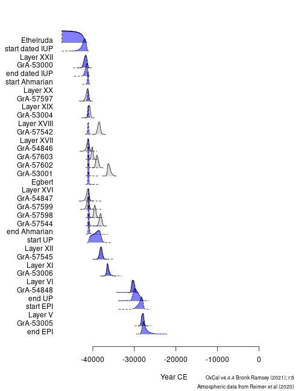

These examples use data available through the [**fasti**](https://packages.tesselle.org/fasti/) package which is available in a [separate repository](https://tesselle.r-universe.dev). **fasti** provides OxCal [@bronkramsey2009] input models.


```r
## Install the latest version
install.packages("fasti", repos = "https://tesselle.r-universe.dev")
```


```r
## Load package
library(aion)

## Download OxCal
oxcal_configure()
#> Attempting to download OxCal from https://c14.arch.ox.ac.uk/OxCalDistribution.zip.
#> OxCal successfully downloaded and extracted to /tmp/Rtmp1dKsFQ/OxCal.
#> OxCal binary found at /tmp/Rtmp1dKsFQ/OxCal/bin/OxCalLinux
```


```r
## Read OxCal script from Bosch et al. 2015
path <- system.file("oxcal/ksarakil/ksarakil.oxcal", package = "fasti")
scr <- readLines(path)

## Print script
# cat(scr, sep = "\n")

## Execute OxCal script
## /!\ this may take a while /!\
out <- oxcal_execute(scr)
#> OxCal v4.4.4 (c) Bronk Ramsey (2021)
#> MCMC analysis
#> Sort	Burn	Trial	Save	Shrink	kPasses	Done	Ok	Convergence
#> [.]	[.]	[.]	[.]		3.0	10.0	100.0	100.0
#> [.]	[.]	[.]	[.]		6.0	20.0	100.0	8.1
#> [.]	[.]	[.]	[.]		12.0	22.2	100.0	14.0
#> [.]	[.]	[.]	[.]		24.0	22.2	100.0	20.4
#> [.]	[.]	[.]	[.]		48.0	22.2	100.0	4.8
#> [.]	[.]	[.]	[.]	[.]	96.0	22.2	100.0	60.0
#> [.]	[.]	[.]	[.]		192.0	22.2	100.0	62.1
#> [.]	[.]	[.]	[.]		384.0	22.2	100.0	90.4
#> [.]	[.]	[.]	[.]		768.0	22.2	100.0	85.2
#> [.]	[.]	[.]	[.]		1152.0	30.0	100.0	93.9
#> [.]	[.]	[.]	[.]		1536.0	40.0	100.0	93.9
#> [.]	[.]	[.]	[.]		1920.0	50.0	100.0	93.9
#> [.]	[.]	[.]	[.]		2304.0	60.0	100.0	90.3
#> [.]	[.]	[.]	[.]		2688.0	70.0	100.0	89.1
#> [.]	[.]	[.]	[.]		3072.0	80.0	100.0	89.1
#> [.]	[.]	[.]	[.]		3456.0	90.0	100.0	89.1
#> [.]	[.]	[.]	[.]		3840.0	100.0	100.0	89.1
#> [.]	[.]	[.]	[.]		4224.0	110.0	100.0	89.1

## Parse OxCal output
res <- oxcal_parse(out)
```


```r
par(mar = c(5, 6, 1, 1) + 0.1)
plot(res)
```



## References
